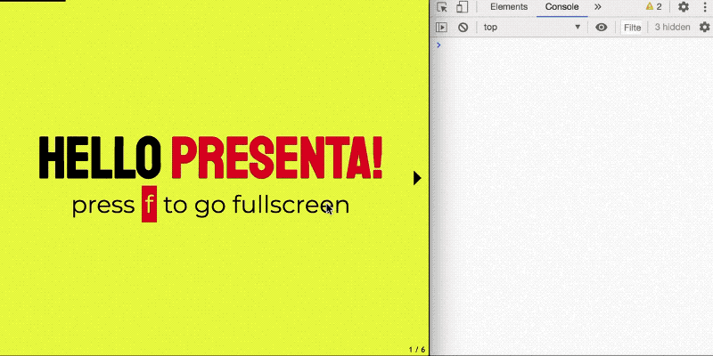

# PRESENTA Console Notes Controller

This controller adds the speaker notes capability in a [PRESENTA Lib](https://github.com/presenta-software/presenta-lib) document using the Console of the Browser' Developer Tools as viewer.



## Installation

Please read the installation istructions for official plugins [here](https://lib.presenta.cc/extend/#install-an-official-plugin) using this unique identifier: `controller-console-notes`

## Usage

To activate this controller use this setting:

```js
controllers:{
  consoleNotes:true
}
```

Then, you need to set on each `scene` the text you want to visualize:

```js
{
  scenes:[
    {
      notes: 'This is the text I want to read while this scene is active',
      type: 'image',
      url: 'myImage.jpg'
    }
  ]
}
```

Additional configurations of the controller can be:

| Option | Description                                | Default                        | Values  |
| ------ | ------------------------------------------ | ------------------------------ | ------- |
| clear  | Clear the console on each scene activation | false                          | Boolean |
| style  | Set a custom style in the Console          | 'color: blue; font-size: 16px' | String  |
|        |                                            |                                |         |


## Development

Run the watcher:

    npm start

and the local webserver

    npm run test

